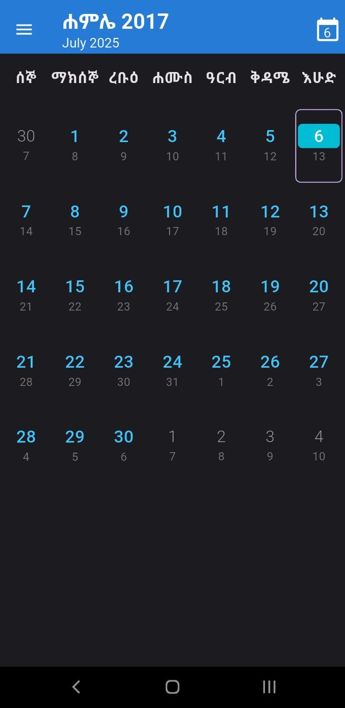
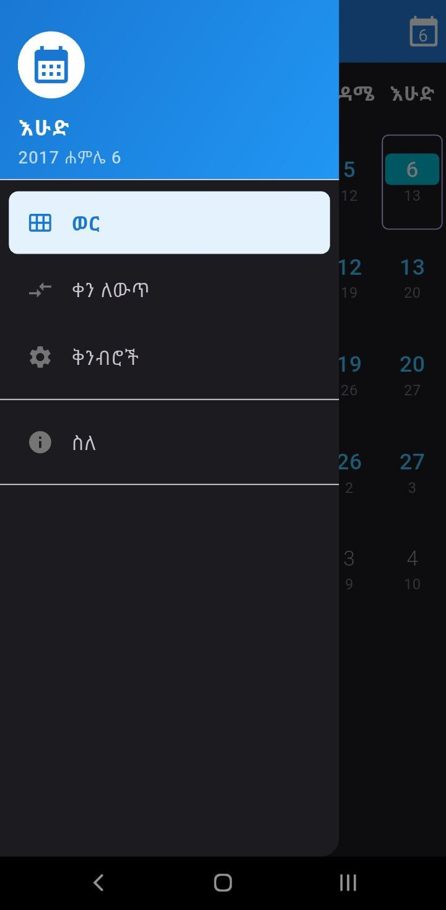
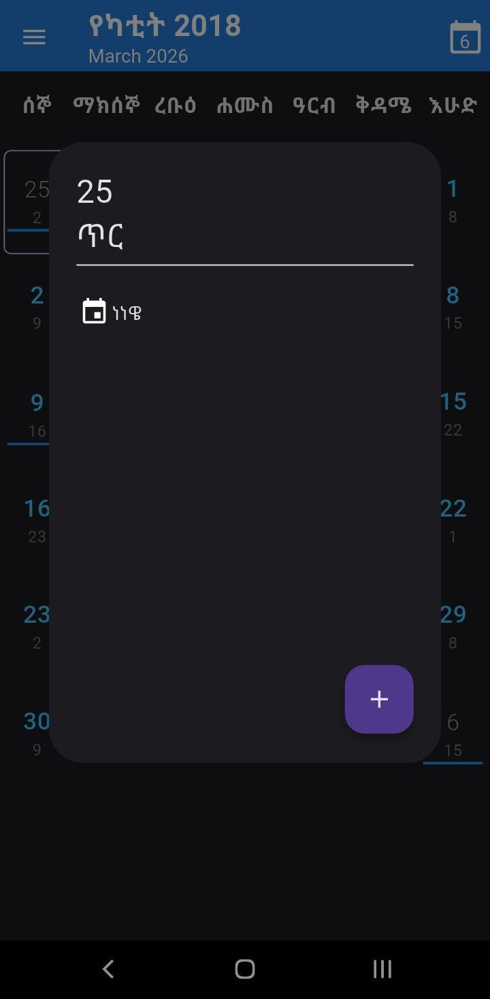
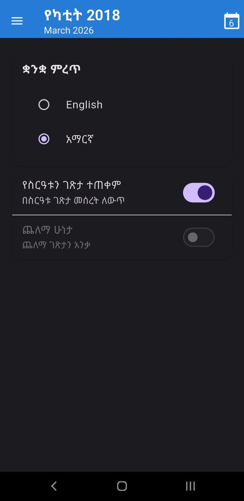

# 📅 Ken Mekuteria (የቀን መቁጠሪያ)

**Ken Mekuteria** is an Ethiopian calendar app that displays a full month view along with the Gregorian calendar. It supports date conversion, shows partial events, and is actively being developed with more features planned.

---

## 🖼️ Screenshots

<p align="center">
  <p float="left">
    
    
  </p>
  <p float="left">
    
    
  </p>
</p>

---

## ✨ Features

- 📆 Ethiopian calendar with full month view
- 📅 Gregorian calendar shown in parallel
- 🔁 Convert between Ethiopian and Gregorian dates
- 🗓️ Partial event display (more coming soon)
- 🌓 Light and dark mode with system theme sync
- 🔄 Actively maintained and updated

---

## 🚀 Getting Started

### Prerequisites

- Flutter SDK installed – [Get Flutter](https://flutter.dev)
- Dart installed
- Android Studio or VS Code

```bash
git clone https://github.com/yourusername/ken-mekuteria.git
cd ken-mekuteria
flutter pub get
flutter run
```

| Package                                                             | Description                                  |
| ------------------------------------------------------------------- | -------------------------------------------- |
| [`abushakir`](https://pub.dev/packages/abushakir)                   | Ethiopian calendar logic and date conversion |
| [`intl`](https://pub.dev/packages/intl)                             | Internationalization and date formatting     |
| [`provider`](https://pub.dev/packages/provider)                     | State management                             |
| [`shared_preferences`](https://pub.dev/packages/shared_preferences) | Store user settings (e.g., theme mode)       |
| [`url_launcher`](https://pub.dev/packages/url_launcher)             | Launch URLs and email apps                   |
| [`package_info_plus`](https://pub.dev/packages/package_info_plus)   | App version and metadata info                |

📜 License
This project is licensed under the MIT License.
See the LICENSE file for details.
